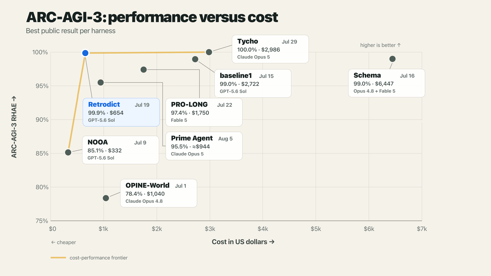
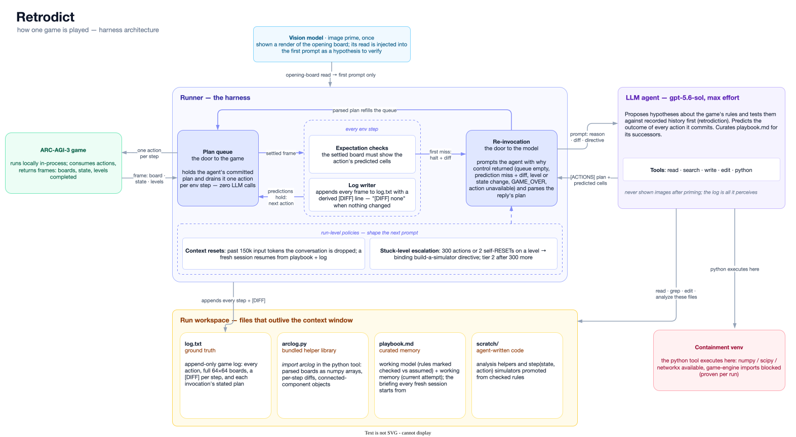

# Retrodict

Retrodict is an agent for [ARC-AGI-3](https://three.arcprize.org). It solves every level of all 25 public games. Its [official scorecard](https://arcprize.org/scorecards/9c403765-db5b-40b1-beab-6fa3f40119b0) reports 99.86% mean RHAE (relative human action efficiency) at a $654 API-list-price cost. Only [Tycho](https://github.com/NIMI-research/Tycho) scores higher in the public harness review: 100.00% at an estimated API-equivalent cost of $2,986. This places Retrodict on the reported cost-performance frontier. Retrodict uses [ThinHarness](https://github.com/ryanbbrown/thinharness) and gpt-5.6-sol at `max` reasoning effort.



*Selected public harnesses above 75% RHAE. Cost methods and run-selection rules differ. See the [comparison methodology](docs/arc-agi-3-harness-comparison.md) for sources and qualifications.*

## How it works

Retrodict is an LLM agent that plays each game like a scientist with a lab notebook. Every frame the game returns is written into a log file, and the agent works over that file with code instead of looking at images. To learn the rules, it proposes hypotheses and tests them against its own recorded history first, writing python that replays a hypothesis over past frames, where being wrong costs nothing. Only a hypothesis that survives the log earns real actions: the agent commits a queue of moves, each carrying the exact cells it predicts the board will show, and the runner plays the queue out one action per step, returning to the model only when the plan runs out or a prediction misses, along with the diff of what went differently. What it establishes about a game is curated into a playbook memory file that outlives its context window. The log-as-context, plan-queue foundation follows [RGB-Agent](https://github.com/alexisfox7/RGB-Agent).



### The harness (encoded in the runner)

- **Plan execution and expectation checking.** Each action in an `[ACTIONS]` plan can carry the cells the settled board must show after it, and the plan an expected level count. The runner plays the queue out one action per step, verifies these after every step, and halts the rest of the plan on the first mismatch, re-invoking the agent with the diff of what went differently. It also re-invokes when the plan runs out, on level or state changes, on GAME_OVER (issuing the restart RESET itself), and when a planned action stops being available.
- **Context resets.** When the conversation grows past a threshold I set (150k input tokens), it is dropped and the agent resumes in a fresh session where only workspace files survive; the fresh session is pointed at `playbook.md` and `log.txt`.
- **Escalation on stuck levels.** After 300 actions (or two self-issued RESETs) on a single level, the runner appends a binding directive to every invocation until the level completes: inventory what the log leaves unexplained and what has never been visited, promote checked rules into an executable `step(state, action)` simulator under `scratch/`, verify it retrodicts every recorded frame, and search it for a route to the goal. If the level resists for another 300 actions, a second tier directs the search toward never-seen board states and re-deriving whichever rule claims the goal is unreachable.
- **Image priming.** Before the first move, a separate vision model is shown a rendered image of the opening board and asked what it sees and what the goal might be. Its answer is injected into the first prompt as a hypothesis to verify, giving the agent an initial visual read the text-only loop wouldn't otherwise have.
- **Perception helpers.** The runner derives a `[DIFF]` line per step in the log (which settled-board cells changed), and a bundled `arclog` library gives the python tool one-call access to parsed boards, diffs, and connected-component objects, so the agent computes over structured data instead of hand-parsing 64×64 grids.
- **Containment.** The agent's python runs in a venv with no game-engine packages, so it can't inspect game internals. Every run writes a `containment.json` proving the engine imports fail, and aborts if they don't.

The agent's toolset, all scoped to the run's workspace: `read`, `write`, `edit`, and `search` (ThinHarness built-ins over workspace files), plus a `python` tool that runs scripts in the containment venv (numpy/scipy/networkx available) with the workspace as working directory. There is no shell tool, and the agent is never shown images after the priming note; everything it perceives comes through `log.txt`.

### The prompt (guidance the model follows)

The system prompt ([src/arc3/prompts.py](src/arc3/prompts.py)) is ~150 lines and game-agnostic. Its main directives:

- **Retrodiction.** Never act blindly: every hypothesis about a game mechanic must first be checked against the recorded history. The agent writes python that replays the hypothesis over past frames in `log.txt`, and if any recorded frame contradicts it, it's falsified for free. Only questions the log can't settle earn a live action. This is a small-scale version of the explicit world-model building [baseline1](https://github.com/astroseger/arc-3-agents-baseline1) does, without the long modeling phase.
- **Forward simulation.** Every action the agent claims to understand must carry an `expect` computed in python before it is played, so a wrong world model costs one action rather than a whole plan. An action taken without a prediction is defined as a wasted action and a failure of process.
- **Playbook memory.** The agent maintains `playbook.md`, a curated briefing for its successor after a context reset, in two parts: a **working model** (controls, mechanics, objective, each point marked checked-against-the-log vs. still-assumed, and held loosely: the log stays ground truth) and **working memory** (the current level's attempt: position, plan, what's been ruled out). The prompt prescribes distilling into the working model when a level completes and compacting rather than journaling, so fresh sessions plan from the playbook instead of re-deriving settled rules from the raw log.
- **Explore, then commit.** While an action's effect is uncertain, probe with single actions and short plans for fast feedback; once a probe confirms a mechanic, stop re-probing and batch every move whose result is predictable. Advancing an understood mechanic one action at a time is called out as the most common way a run stalls.
- **HUD guidance.** From Tufa Labs' [Duck harness](https://www.kaggle.com/code/jeroencottaar/tufa-labs-duck-harness-june-30-milestone-winner) (Kaggle milestone-1 winner) on Kaggle, the agent is told that a full-width or full-height strip hugging a board edge that changes on most steps is a timer or step budget, not gameplay; it should be tracked as a deadline, not treated as evidence an action worked.
- **RESET discipline.** RESET discards the whole attempt, so back out with undo when it's available instead; never issue two RESETs in a row, since a second RESET on an already-fresh attempt restarts the entire game from level 1.
- **Bounded search.** Python searches must be built incrementally and cost-estimated before running, with explicit iteration or wall-time caps; a timeout means the search was too big, never evidence that no solution exists.

## Performance

Retrodict scores **99.86% mean RHAE across all 25 public games and solves every level**. The ARC-AGI-3 server recorded the result on an [official competition-mode scorecard](https://arcprize.org/scorecards/9c403765-db5b-40b1-beab-6fa3f40119b0). Of the 25 games, 23 score 100% RHAE. The other scores are 98.64% for sk48 and 97.77% for sp80. The campaign used 7,703 actions and 660M tokens. It cost $654 at gpt-5.6-sol API list prices.

| Harness | Best public result | Cost used | Run and coverage |
|---|---:|---:|---|
| [Tycho](https://github.com/NIMI-research/Tycho) | 100.00% | $2,986 | One full 25-game run |
| **Retrodict** | **99.86%** | **$654** | One full 25-game run; all 183 levels solved |
| [Schema](https://schema-harness.github.io/) | 98.98% | At least $6,447 | Fixed conditional reruns; higher result retained |
| [baseline1](https://github.com/astroseger/arc-3-agents-baseline1) | 98.97% | $2,722 | One full 25-game run |
| [PRO-LONG](https://github.com/alexisfox7/PRO-LONG) | 97.4% best@2 | $1,750 | Selective second runs |
| [Prime Agent](https://github.com/PrimeIntellect-ai/prime-agent) | 95.5% | Approximately $944 | Three full runs; best result shown |
| [NOOA](https://github.com/NVIDIA-NeMo/labs-OO-Agents) | 85.13% | $332 | One 25-game fleet under a two-hour cap |
| [OPINE-World](https://github.com/david-courtis/opine-world) | 78.37% | $1,040 | One full 25-game run |

The table uses one best public result per harness. Costs may be submitted, estimated, or converted to API-equivalent prices. The [comparison methodology](docs/arc-agi-3-harness-comparison.md) lists every reviewed harness, source, cost basis, and run qualification.

### Same-model comparison

baseline1 gives the cleanest token comparison. Both projects publish token usage and use the same model and price schedule. baseline1 publishes per-game data for two configurations at two effort levels:

| Run | Mean RHAE | Actions | Total tokens | API-price cost |
|---|---:|---:|---:|---:|
| **Retrodict (max)** | **99.86%** | **7,703** | **0.66B** | **$654** |
| baseline1 twma (max) | 95.97% | 10,111 | 1.20B | $918 |
| baseline1 twma (xhigh) | 92.34% | 16,893 | 1.34B | $970 |
| baseline1 ewma_sv (max) | 98.77% | 7,758 | 3.97B | $3,105 |
| baseline1 ewma_sv (xhigh) | 98.97% | 8,347 | 3.64B | $2,722 |

Against baseline1's best-scoring run, Retrodict scores 0.89 percentage points higher with 5.5x fewer tokens. The textual world model agent (twma) is the closest architecture comparison because it reasons over text. Retrodict also reasons over text but builds a simulator after escalation on stuck levels. Retrodict scores 3.89 points higher than twma max with 1.8x fewer tokens. Every row solves every level except twma xhigh, which leaves bp35 and lf52 unfinished.

The costs use the same API list prices. These prices are $5.00 for input, $0.50 for cached input, and $30.00 for output per million tokens. baseline1 ran through Codex, so its costs are API-price equivalents. **Tokens are the primary comparison.**

Per-game breakdowns with raw token counts: [Retrodict](docs/per-game-costs.md), [baseline1](docs/baseline1-per-game-costs.md).

An earlier submitted run (gpt-5.6-sol at `high`, 84.52% mean RHAE, 21/25 games solved) is archived with its tables and disclosures in [docs/archive/2026-07-14-gpt-5.6-sol-high.md](docs/archive/2026-07-14-gpt-5.6-sol-high.md).

## Validity

The same agent and prompts play every game. The system prompt ([src/arc3/prompts.py](src/arc3/prompts.py)) is ~150 lines and ~2,500 tokens, and contains no game-specific information: no game IDs, mechanics, heuristics, or solutions. Everything game-specific the agent knows, it learned inside the run, and the helper code it wrote per game is preserved in each run's `workspace/scratch/`. I looked at a couple of games early on while building the harness; most of the 25 I have never viewed and don't know how they work.

Each game's result is a single run. Two games needed a fresh run, with no harness or prompt changes between attempts:

- **tn36**: the first run was part of an experiment to see how max effort would impact performance and was stopped at 3/7. When the full campaign was run, I didn't realize that this initial run actually used the final version of the harness, so a fresh max run was submitted. See [the run comparison](docs/run-comparisons.md#tn36-experiment-run-vs-campaign-run).
- **bp35**: an initial max-effort run was in progress when the coding agent supervising the campaign thought it was struggling on a level and canceled it, resuming at `high` effort instead. That meant the run wasn't a fully max-effort run, and couldn't be used; in hindsight it was on a slightly better pace than the fresh max run. See [the run comparison](docs/run-comparisons.md#bp35-canceled-run-vs-winning-run).

All games also had earlier attempts during development, but other than the two mentioned above, every game was only run a single time with this final harness version and effort configuration.

The runs were played on the local runner (games execute in-process from downloaded environment files, without the ARC-AGI-3 API). To produce the official scorecard, `scripts/replay_runs.py` replayed each run's recorded actions through the API on a competition-mode card. This was done because the games were run with intermittent internet access and would have tripped the server's idle timeout: a live game session closes after roughly 15 minutes without an action, and a max-effort run regularly thinks for longer than that between moves.

Every run's complete trace (logs, transcripts, playbook, per-request token usage) is also downloadable from [releases](https://github.com/ryanbbrown/Retrodict/releases) for independent verification.

## Running it

```bash
uv sync
./scripts/setup_analysis_venv.sh   # containment venv the agent's python tool runs in
```

`OPENAI_API_KEY` is required (in `../thinharness/.env`). Games download into `environment_files/` on first use and run locally in-process.

```bash
uv run --env-file ../thinharness/.env arc3-run <game> --model openai:gpt-5.6-sol --effort max --cost-cap 20 --image-prime
```

Useful flags: `--resume <run_dir>` continues an interrupted or cost-capped run in place (replays the log deterministically, then spends new budget); `--cost-cap` / `--action-cap` bound a run; `--mode online` plays the real API instead of local game files.

Tests and checks:

```bash
uv run pytest
uv run ruff check src tests scripts
```

## Layout

```
src/arc3/
  runner.py           # per-game controller: env loop, action queue, re-invocation, caps, metrics; arc3-run CLI
  prompts.py          # system + re-invocation prompts
  logwriter.py        # observations -> log.txt, and the parse-back used for replay
  plan_parser.py      # extract/validate the [ACTIONS] block
  tools.py            # PythonTool: runs agent scripts in the containment venv
  vision.py           # image priming: render the opening frame, ask a vision model
workspace_template/   # copied into each run's workspace (arclog.py helper, scratch/)
scripts/              # setup_analysis_venv.sh, cost table generators, scorecard replay
environment_files/    # downloaded game files
runs/                 # one directory per run (gitignored)
docs/                 # per-game cost tables
tests/
```
